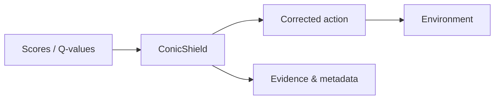

# ConicShield

[](https://www.python.org/)
[](LICENSE)

**Runtime safety through convex projection — with evidence you can replay, validate, and govern.**

A policy proposes an action. ConicShield solves a constrained optimization problem to find the **nearest admissible** action under explicit safety constraints. The world sees the **corrected** action, not the raw proposal. Every intervention yields structured records you can hash, audit, and benchmark under family policy.



---

## Why this repository exists

ConicShield is not only a solver wrapper. It ships a **full governance spine**: validated benchmark bundles, native–reference **parity** gates, promotion rules, release orchestration, audit CLI, and dashboards — so benchmark claims stay meaningful as code and contracts evolve.

**Shield projection (implemented constraint kinds):** `simplex`, `turn_feasibility`, `box`, `rate`. `progress` and `clearance` are deferred; see [`docs/adr/001-progress-clearance-constraints.md`](docs/adr/001-progress-clearance-constraints.md).

| Mode | Who it’s for |
|------|----------------|
| **Public / reference** | Contributors without vendor secrets: governance, schemas, replay, CI-green core tests. |
| **Vendor (Moreau)** | Opt-in, Linux/WSL2: native compiled path, CUDA where licensed, **Vendor CI** workflow `vendor-ci-moreau` (manual dispatch). |

---

## Installation

### Public / reference (matches default CI)

On **Linux / WSL**, use a **virtual environment** first (system Python is often PEP 668–protected and may only expose `python3`). See **Linux / WSL** under [docs/DEVENV.md](docs/DEVENV.md).

```bash
python -m pip install --upgrade pip
python -m pip install -e ".[dev]"
```

After editing dev dependencies in `pyproject.toml`, refresh the lockfile:

```bash
make compile-deps
```

### Vendor Moreau (extra index + license)

Use **Linux or WSL2**. This project expects the **vendor-distributed** Moreau stack — not an arbitrary `pip install moreau` from the default index.

```bash
export MOREAU_EXTRA_INDEX_URL="https://<TOKEN>:@pypi.fury.io/optimalintellect/"
export MOREAU_LICENSE_KEY="<YOUR_MOREAU_LICENSE_KEY>"
bash scripts/bootstrap_moreau.sh
```

Or install manually:

```bash
python -m pip install -e ".[dev]"
python -m pip install "moreau[cuda]" --extra-index-url "$MOREAU_EXTRA_INDEX_URL"
python -m moreau check
```

**Secrets:** never commit tokens, license keys, or a filled-in `.env`. Copy [`.env.example`](.env.example) to `.env` for local variable names only.

**Live vendor test lane (local):** after `moreau check` succeeds, run solver-marked tests with keys from `.env`:

```bash
python scripts/run_live_vendor_tests.py
# Optional: python scripts/run_live_vendor_tests.py --parallel auto -- -k native
```

See [`tests/live/README.md`](tests/live/README.md) for details.

---

## Supported Python & CI

| | |
|:---|:---|
| **Python** | **3.11+** (`requires-python` in [`pyproject.toml`](pyproject.toml)) |
| **CI matrix** | **3.11** and **3.12** — ruff, mypy, pytest + coverage (no solver extras by default) |
| **Details** | [docs/DEVENV.md](docs/DEVENV.md) — pytest markers, optional workflows, Vendor CI |
| **Moreau docs** | [Installation](https://docs.moreau.so/installation.html) · [CVXPY integration](https://docs.moreau.so/guide/cvxpy-integration.html) |

---

## Quick commands

| Goal | Command |
|------|---------|
| Live tests (Moreau + optional inter-sim-rl; reads `.env`) | `python scripts/run_live_vendor_tests.py --bootstrap` once per venv, then `python scripts/run_live_vendor_tests.py` |
| Governed bundle steps (validate → parity fixture → index check) | `python scripts/governed_local_promotion.py --help` |
| Validate a run bundle | `python -m conicshield.artifacts.validator_cli --run-dir benchmarks/runs/<run_id>` |
| Strict governance audit | `python -m conicshield.governance.audit_cli --strict` |
| Finalize run + optional parity path + optional CURRENT sync | `python -m conicshield.governance.finalize_cli --run-dir ... --family-id ... --task-contract-version v1 --fixture-version fixture-v1 --reference-fixture-dir tests/fixtures/parity_reference --parity-summary-path output/.../parity_summary.json --current-release-path benchmarks/releases/<family>/CURRENT.json` (add `--sync-current-release` to push gates into `CURRENT.json` for the same published run) |
| Governance dashboard JSON/MD | `python -m conicshield.governance.dashboard_cli --json-output output/governance_dashboard.json --markdown-output output/governance_dashboard.md` |
| Release dry-run | `python -m conicshield.governance.release_cli --run-dir benchmarks/runs/<run_id> --family-id conicshield-transition-bank-v1 --reason "candidate release review" --dry-run` |

---

## Tests

Default `make test` / `pytest` runs the core suite and **excludes** vendor-only and slow markers (see [docs/DEVENV.md](docs/DEVENV.md)).

```bash
make test
make test-reference          # same as default filters, explicit
make test-vendor-moreau      # requires Moreau + license
make test-solver             # solver-marked aggregate
make smoke-solver            # solver smoke CLI JSON
```

---

## Verification ladder

Layered checks (environment → smoke → reference correctness → parity → performance → governance) are documented in **[docs/VERIFICATION_AND_STRESS_TEST_PLAN.md](docs/VERIFICATION_AND_STRESS_TEST_PLAN.md)** (commands, artifacts, and policies).

**Typical local sequence**

```bash
make env-check
make smoke-check
make reference-correctness
make trust-dashboard
# With vendor stack: make perf-benchmark, make parity-native-licensed
# Layer G / D helpers: make artifact-validation-report
# After parity: make parity-report
```

Artifacts land under `output/` (ignored by git). **CI** uploads `output/` as `verification-output-<python-version>`. The **Vendor CI** workflow (`vendor-ci-moreau`) produces a **`vendor_verification_bundle`** (env, smoke, reference correctness, performance plots when solves succeed, parity, artifact validation report, parity report, trust dashboard).

---

## Repository layout

```text
conicshield/     # installable package: adapters, bench, core, governance, parity, specs
schemas/         # JSON Schema for bundles (repo root; not packaged)
benchmarks/      # registry, releases; published bundles under benchmarks/published_runs/
scripts/         # maintainer CLIs (env, smoke, perf, trust dashboard)
tests/           # pytest; see tests/README.md (e.g. tests/reference/ for Layer C)
docs/            # architecture, policies, verification ladder
third_party/     # upstream pins and patches (not full checkouts)
```

---

## Design principles

1. **Formal intent, operational enforcement** — constraints are not decorative.
2. **Minimal intervention** — project only as far as safety requires.
3. **Evidence by default** — every shield step is recordable.
4. **Reproducible bundles** — benchmarks are artifacts, not ad hoc logs.
5. **Parity before trust** — native compiled paths must match the governed reference stream.
6. **Families, not silent overwrites** — semantic task changes fork benchmark families.

---

## Documentation map

See also [`docs/README.md`](docs/README.md) for a compact index.

**Status & roadmap**

- [`docs/ENGINEERING_STATUS.md`](docs/ENGINEERING_STATUS.md) — what is implemented, CI, solver pins
- [`docs/ROADMAP.md`](docs/ROADMAP.md) — external dependencies and deferred work

**Verification & trust**

- [`docs/VERIFICATION_AND_STRESS_TEST_PLAN.md`](docs/VERIFICATION_AND_STRESS_TEST_PLAN.md) — trust ladder, layers, performance/differentiation policy
- [`docs/DEVENV.md`](docs/DEVENV.md) — Python matrix, markers, workflows

**Governance & benchmarks**

- [`docs/BENCHMARK_GOVERNANCE.md`](docs/BENCHMARK_GOVERNANCE.md) · [`docs/NATIVE_ARM_PUBLISH_CHECKLIST.md`](docs/NATIVE_ARM_PUBLISH_CHECKLIST.md)
- [`docs/RELEASE_POLICY.md`](docs/RELEASE_POLICY.md) · [`docs/PARITY_AND_FIXTURES.md`](docs/PARITY_AND_FIXTURES.md)
- [`benchmarks/DASHBOARD_README.md`](benchmarks/DASHBOARD_README.md) · [`benchmarks/runs/README.md`](benchmarks/runs/README.md)
- [`docs/MAINTAINER_RUNBOOK.md`](docs/MAINTAINER_RUNBOOK.md)

**Moreau & solvers**

- [`docs/MOREAU_INSTALL_AND_ENVIRONMENT_POLICY.md`](docs/MOREAU_INSTALL_AND_ENVIRONMENT_POLICY.md)
- [`docs/MOREAU_API_NOTES.md`](docs/MOREAU_API_NOTES.md)
- Parity, performance, and differentiation policies: [`docs/PARITY_AND_FIXTURES.md`](docs/PARITY_AND_FIXTURES.md), [`docs/VERIFICATION_AND_STRESS_TEST_PLAN.md`](docs/VERIFICATION_AND_STRESS_TEST_PLAN.md)

**Design & integration**

- [`docs/ARCHITECTURE.md`](docs/ARCHITECTURE.md)
- [`docs/INTER_SIM_RL_INTEGRATION.md`](docs/INTER_SIM_RL_INTEGRATION.md)
- [`docs/adr/001-progress-clearance-constraints.md`](docs/adr/001-progress-clearance-constraints.md)

**Tests**

- [`tests/README.md`](tests/README.md)

---

## Optional dependencies

Governance, artifact validation, and audit paths run **without** `cvxpy` or `moreau`. If the solver stack is absent: governance tests still pass, parity replay can use fakes, and solver-backed execution fails with an explicit optional-dependency error.
