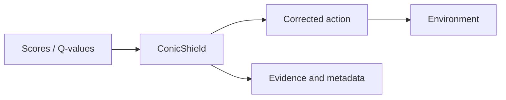

<div align="center">

<pre>
###############################################################################################
#                     ____            _      ____  _     _      _     _                       #
#                    / ___|___  _ __ (_) ___/ ___|| |__ (_) ___| | __| |                      #
#                   | |   / _ \| '_ \| |/ __\___ \| '_ \| |/ _ \ |/ _` |                      #
#                   | |__| (_) | | | | | (__ ___) | | | | |  __/ | (_| |                      #
#                    \____\___/|_| |_|_|\___|____/|_| |_|_|\___|_|\__,_|                      #
#                                                                                             #
###############################################################################################
</pre>

[](https://www.python.org/)
[](LICENSE)

**Runtime safety through convex projection — with evidence you can replay, validate, and cite.**

</div>

A policy proposes an action. ConicShield solves a constrained optimization problem to find the **nearest admissible** action under explicit safety constraints. The environment sees the **corrected** action. Each step can be recorded as structured, hash-verified benchmark evidence.

---

## Start here (community)

> **Product homepage:** [`docs/COMMUNITY_LAYER.md`](docs/COMMUNITY_LAYER.md)  
> **v1 release:** [`docs/V1_REFERENCE_RELEASE.md`](docs/V1_REFERENCE_RELEASE.md)  
> **After install, run:** `make onboard`

| Link | Purpose |
|------|---------|
| [Community layer](docs/COMMUNITY_LAYER.md) | Quickstarts, API, examples, public claims |
| [Published-runs API](docs/PUBLISHED_RUNS_API.md) | Frozen v1 Python + CLI (`list`, `current`, `verify`, …) |
| [Examples](examples/README.md) | Runnable scripts (researcher + integrator) |
| [CONTRIBUTING.md](CONTRIBUTING.md) | PR workflow and maintainer targets |

All public docs: [`docs/README.md`](docs/README.md).

### Try it in about a minute

From the repository root (Linux, macOS, or WSL recommended):

```bash
python3 -m venv .venv
source .venv/bin/activate          # Windows: .venv\Scripts\activate
python -m pip install -U pip
python -m pip install -e ".[dev]"
make onboard
python examples/load_published_runs_api.py
```

`make onboard` runs community tests, verifies the flagship bundle integrity, and prints a v1 status snapshot.

---

## How it works


```mermaid
flowchart LR
    Q[Scores / Q-values] --> S[ConicShield]
    S --> A[Corrected action]
    S --> E[Evidence and metadata]
    A --> R[Environment]
```

---

## v1 reference artifact (flagship)

| Item | Value |
|------|--------|
| Flagship run | [`host-realistic-20260525`](benchmarks/published_runs/host-realistic-20260525/) |
| Family | `conicshield-transition-bank-v1` |
| Evidence tier | `vendor_native`, `real_projector` |
| Export | `live_upstream_dump` (host-realistic **fork** topology) |
| Machine status | [`benchmarks/reports/reference_system_status.json`](benchmarks/reports/reference_system_status.json) |

**Read first:** [`COMMUNITY_METADATA.json`](benchmarks/published_runs/host-realistic-20260525/COMMUNITY_METADATA.json) before `summary.json`.

| Artifact | Path |
|----------|------|
| Integrity index | [`benchmarks/PUBLISHED_RUN_INDEX.json`](benchmarks/PUBLISHED_RUN_INDEX.json) |
| Family current | [`benchmarks/releases/conicshield-transition-bank-v1/CURRENT.json`](benchmarks/releases/conicshield-transition-bank-v1/CURRENT.json) |
| Upstream export | [`benchmarks/external_evidence/offline_graph_export_upstream.json`](benchmarks/external_evidence/offline_graph_export_upstream.json) |

**Scope (honest bounds):** host-realistic **fork** topology only (does not prove full upstream navigation export). Batch narrative is **viability-only** (does not claim throughput wins). Differentiation is **validation-only** (not a public autograd product). Details: [`docs/PUBLIC_CLAIMS.md`](docs/PUBLIC_CLAIMS.md), [`docs/SOLVER_PATHS_AND_BATCHING.md`](docs/SOLVER_PATHS_AND_BATCHING.md), [`docs/DIFFERENTIATION_PUBLIC_STANCE.md`](docs/DIFFERENTIATION_PUBLIC_STANCE.md).

**Constraints in v1:** `simplex`, `turn_feasibility`, `box`, `rate` — not `progress` / `clearance`.

### Consumer API (stable v1)

```python
from conicshield.published_runs import get_current_run, verify_run, load_summary

verify_run("host-realistic-20260525")
bundle = get_current_run("conicshield-transition-bank-v1")
print(bundle.run_id, bundle.community.known_limitations)
```

CLI: `python -m conicshield.published_runs.cli verify host-realistic-20260525`  
Canonical walkthrough: [`examples/load_published_runs_api.py`](examples/load_published_runs_api.py)

---

## Installation

### Default (public CI — no vendor secrets)

Use a **virtual environment** on Linux/WSL ([`docs/DEVENV.md`](docs/DEVENV.md)):

```bash
python -m pip install -e ".[dev]"
make onboard
```

### Vendor Moreau (optional — native compiled path)

Linux/WSL2 + [Moreau license](https://docs.moreau.so/installation.html). Do not commit tokens or `.env` secrets.

```bash
export MOREAU_EXTRA_INDEX_URL="https://<TOKEN>:@pypi.fury.io/optimalintellect/"
export MOREAU_LICENSE_KEY="<YOUR_MOREAU_LICENSE_KEY>"
bash scripts/bootstrap_moreau.sh
python -m moreau check
```

Live vendor tests: `python scripts/run_live_vendor_tests.py` ([`tests/live/README.md`](tests/live/README.md)).

---

## Verify before you trust

| Command | Who | What it checks |
|---------|-----|----------------|
| `make onboard` | Everyone | Community API, examples smoke, flagship integrity |
| `make verify-v1-lock-quick` | Auditors | Index, cadence, bundle profile, public claims |
| `make verify-v1-lock` | Maintainers | Full gate before a public “locked” announcement |

```bash
make verify-v1-lock-quick
python scripts/verify_v1_lock.py --json
```

---

## Development

| | |
|:---|:---|
| **Python** | 3.11+ (CI: 3.11, 3.12) |
| **Default tests** | `make test` (excludes vendor-only / slow markers) |
| **Lint / types** | `make lint` · `make typecheck` |
| **CI overview** | [`docs/DEVENV.md`](docs/DEVENV.md) |

Maintainer publish/refresh: `make verify-reference-system`, `make host-realistic-refresh-cycle-licensed` — see [`CONTRIBUTING.md`](CONTRIBUTING.md).

---

## Repository layout

```text
conicshield/          # library: core, specs, governance, published_runs API
benchmarks/           # published_runs/, releases/, reports/
examples/             # public runnable scripts
docs/                 # start at COMMUNITY_LAYER.md
scripts/              # maintainer and verification CLIs
tests/                # pytest
schemas/              # bundle JSON Schema
```

---

## Design principles

1. **Formal intent, operational enforcement** — constraints are not decorative.
2. **Minimal intervention** — project only as far as safety requires.
3. **Evidence by default** — shield steps are recordable and indexable.
4. **Reproducible bundles** — benchmarks are artifacts, not ad hoc logs.
5. **Parity before trust** — native paths must match the governed reference stream.
6. **Families, not silent overwrites** — semantic changes fork benchmark families.

---

## License

MIT — see [LICENSE](LICENSE).
