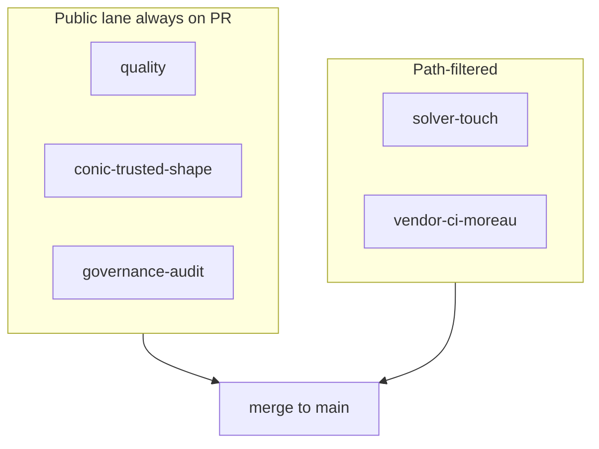

# CI merge gates (recommended)

GitHub branch protection is configured in the repository settings, not in this tree. Recommended **required** checks for `main` (see [`BRANCH_PROTECTION.md`](BRANCH_PROTECTION.md)):

| Check | Workflow | Role |
|-------|----------|------|
| `quality` | [`ci.yml`](../.github/workflows/ci.yml) | Ruff, Ruff format, Mypy, default-marker pytest + coverage, verification scripts |
| `conic-trusted-shape` | [`ci.yml`](../.github/workflows/ci.yml) | Public CLARABEL/SCS conic structural gate (no vendor MOREAU) |
| `governance-audit` | [`governance-audit.yml`](../.github/workflows/governance-audit.yml) | `refresh_published_run_index.py --check` (required + optional integrity surface); governance `audit_cli` rehearsal |
| `solver-touch` | [`solver-touch.yml`](../.github/workflows/solver-touch.yml) | **Path-filtered:** index SHA-256 vs disk, parity-note `run_id`s, native-arm publish evidence, parity tests |

**Path-filtered `solver-touch`:** the job is listed as required in branch protection but **skips** on PRs that do not touch solver/parity/benchmark paths (see workflow `paths:`). That is intentional: unrelated docs-only PRs should not wait on parity replay.

## Two trust lanes

| Lane | Checks | Secrets |
|------|--------|---------|
| **Public** | `quality`, `conic-trusted-shape`, `governance-audit` | None |
| **Vendor** | `vendor-ci-moreau` (path-triggered on canonical repo PRs + manual dispatch) | `GEMFURY_TOKEN`, `MOREAU_LICENSE_KEY` |

`conic-trusted-shape` is the permanent public structural compromise: broad CI coverage without vendor credentials.

## Vendor Moreau policy (hybrid — closed)

[`solver-ci.yml`](../.github/workflows/solver-ci.yml) (`vendor-ci-moreau`):

- **`workflow_dispatch`** — always available on the canonical repo.
- **`pull_request`** — same path filters as `solver-touch` when secrets exist.

PRs that touch native/Moreau/parity/published-run code on the **canonical** repository should get an automatic vendor run. **Forks** and secret-less environments: maintainer attestation (green manual vendor workflow or local `make test-vendor-moreau`) before merge. Document the workflow run URL in the PR.

See [`DEVENV.md`](DEVENV.md) for the full matrix and optional workflows.
