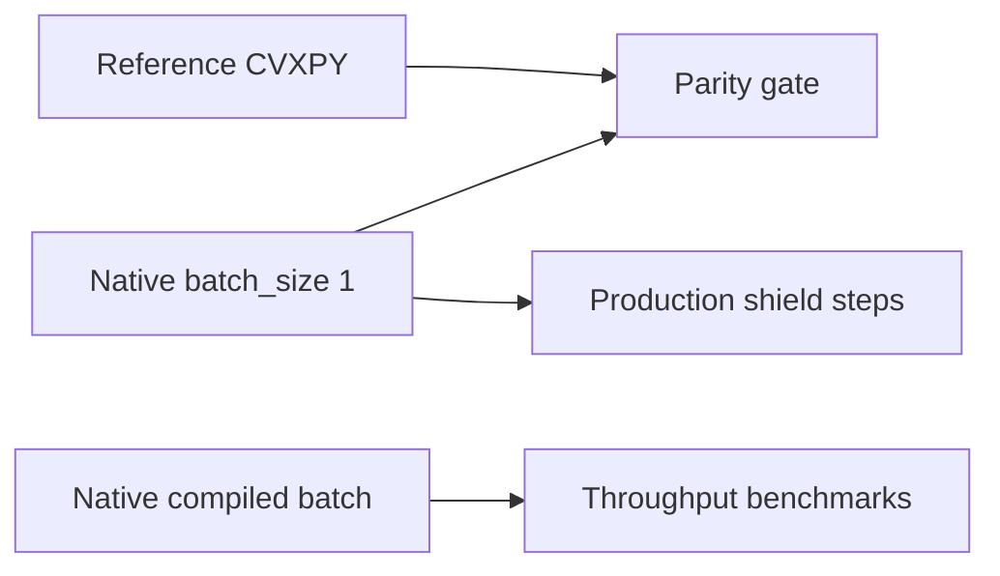

# Solver paths and batching

ConicShield exposes three solve surfaces for the same QP family. Use this guide to pick the right path and to report benchmark evidence consistently.

## Path comparison

| Path | API / backend | Batch behavior | When to use |
|------|----------------|----------------|-------------|
| **Reference** | `CVXPYMoreauProjector`, `cp.MOREAU` | One problem per call | Parity gold, governance reference arm (`shielded-rules-plus-geometry`) |
| **Sequential native** | `Backend.NATIVE_MOREAU`, `NativeMoreauCompiledProjector` | `CompiledSolver` with `batch_size=1` per shield step | Production inter-sim shield steps, warm-start reuse |
| **True compiled batch** | `Backend.NATIVE_MOREAU_BATCH`, `create_batch_projector()` | One `CompiledSolver.solve(qs, bs)` per `project_batch` | Multi-proposal throughput, benchmark speedup evidence |
| **Microbatch loop** | `native_microbatch` in `performance_benchmark.py` | Python loop over sequential solves | Baseline comparison only — not the production batch API |

Programmatic entry points:

- Single step: `create_projector(Backend.NATIVE_MOREAU, ...)`
- Batch: `create_batch_projector(...)` → `NativeMoreauCompiledBatchProjector`
- Shield: `InterSimConicShield` (sequential) or `project_softmax_batch` (native batch path where applicable)

Details: [`MOREAU_API_NOTES.md`](MOREAU_API_NOTES.md), [`ARCHITECTURE.md`](ARCHITECTURE.md).

## Benchmark commands (licensed host)

Generate timing rows (includes `native_microbatch` vs `native_compiled_real_batch`):

```bash
python scripts/performance_benchmark.py
# optional sweep:
python scripts/performance_benchmark.py --sweep --batch-sizes 4,8,16
```

Summarize speedup (sequential mean / batched mean):

```bash
python scripts/batch_solve_report.py output/performance_summary.json
# writes output/batch_solve_report.json by default
```

## Evidence in governed runs

Published benchmark bundles (`benchmarks/published_runs/<run_id>/`) record **per-arm** metrics in `summary.json`. The reference and native arms use sequential per-step solves inside `reference_run`. Batch speedup is **orthogonal** evidence from `performance_benchmark.py` / `batch_solve_report.json`, not a substitute for parity or promotion gates.

Flagship host-realistic export loop: [`HOST_REALISTIC_RUNBOOK.md`](HOST_REALISTIC_RUNBOOK.md). Evidence tiers: [`REFERENCE_EVIDENCE_TIERS.md`](REFERENCE_EVIDENCE_TIERS.md).

## Mental model



**Strongest production path:** sequential native with warm-start. **Strongest throughput path:** `NATIVE_MOREAU_BATCH`. **Ground truth for gates:** reference + parity replay on the frozen fixture.
