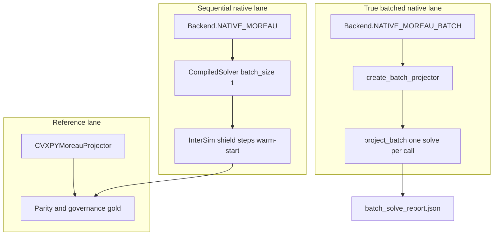

# Solver paths and batching

ConicShield exposes **three production-relevant solve modes** for the same QP family. Batch is a **first-class API**, not an internal benchmark trick.

## Architecture (three modes)



| Mode | API | Batch behavior | Primary use |
|------|-----|----------------|-------------|
| **1 — Reference** | `CVXPYMoreauProjector`, `cp.MOREAU` | One QP per call | Parity gold, `shielded-rules-plus-geometry` |
| **2 — Sequential native** | `Backend.NATIVE_MOREAU`, `create_projector()` | `CompiledSolver` with `batch_size=1` | Production shield steps, warm-start |
| **3 — True compiled batch** | `Backend.NATIVE_MOREAU_BATCH`, `create_batch_projector()` | Single `solve(qs, bs)` over stacked problems | Throughput, multi-proposal shields |
| *(baseline only)* | `native_microbatch` in benchmarks | Python loop calling sequential | Compare against mode 3 only |

**Default rule:** use mode 2 for single-step shields; use mode 3 when you have multiple proposals with shared structure.

## Programmatic entry points

```python
from conicshield.core.solver_factory import Backend, create_batch_projector, create_projector

# Sequential native (production step)
projector = create_projector(spec, backend=Backend.NATIVE_MOREAU)

# True batch (throughput)
batch_projector = create_batch_projector(spec, backend=Backend.NATIVE_MOREAU_BATCH)
```

Shield: `InterSimConicShield.project` (sequential) or `project_softmax_batch` (native batch path).

Details: [`MOREAU_API_NOTES.md`](MOREAU_API_NOTES.md), [`ARCHITECTURE.md`](ARCHITECTURE.md).

## Benchmark and verification bundle

Licensed host standard sequence:

```bash
python scripts/performance_benchmark.py --batch-size 4
python scripts/batch_solve_report.py
python scripts/check_batch_acceptance.py
```

`batch_solve_report.json` is part of the **vendor verification bundle** (Vendor CI and `run_live_vendor_tests.py`). Policy: [`benchmarks/reports/batch_acceptance_policy.json`](../benchmarks/reports/batch_acceptance_policy.json).

### Acceptance threshold (vendor)

Sweep mode (`--sweep --batch-sizes 4,8,16`): **at least one row** must have `speedup_ratio >= 0.98` (compiled batch viable vs microbatch on CPU). Policy: [`batch_acceptance_policy.json`](../benchmarks/reports/batch_acceptance_policy.json). Throughput wins (`> 1.05`) are tracked in `batch_solve_report.json` but are scenario-dependent.

## Regression tests (vendor lane)

| Test | What it proves |
|------|----------------|
| `tests/vendor/native/test_native_moreau_projector.py::test_batched_compiled_matches_sequential_native` | Mode 3 matches mode 2 within tolerance |
| `tests/vendor/native/test_shield_native_softmax_batch.py` | Shield batch path matches sequential row |
| `tests/core/test_solver_factory.py` | `NATIVE_MOREAU_BATCH` is the batch factory default |

Public CI runs factory contracts; full numeric batch parity runs under **`vendor-ci-moreau`** (solver-touch scope).

## Governed benchmark bundles

Published runs record **per-arm sequential** metrics in `summary.json`. Batch speedup is **orthogonal throughput evidence**, not a substitute for parity or promotion gates.

Flagship: [`HOST_REALISTIC_REFRESH_PROCEDURE.md`](HOST_REALISTIC_REFRESH_PROCEDURE.md). Evidence tiers: [`REFERENCE_EVIDENCE_TIERS.md`](REFERENCE_EVIDENCE_TIERS.md).
